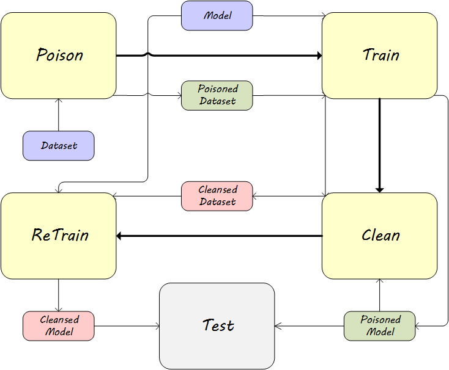

# Comprehensive Backdoor Attack and Defense Evaluation Framework

This code framework refers to the process handling and partial method implementation from [here](https://github.com/Unispac/Fight-Poison-With-Poison) and has been rewritten by [Yichi Zhang](https://yichics.github.io) as a submission for the Machine Learning course assignment.

This code is used to evaluate existing machine learning backdoor attack and defense methods, currently supporting the following:

**Attack**: BadNet, Blend, Clean-Label, Dynamic, ISSBA, SIG, TaCT, WaNet, Trojan, Adaptive-Blend, Adaptive-Patch
**Defense**: Activation Clustering, Spectral Signature, SCAn, Strip, Confuse Training
**Dataset**: CIFAR10

We provide a `demo.sh` to execute a test case, which will run the experiments according to the flowchart. If you want to conduct other experiments, please modify the parameters at the beginning of the file. Before adjusting the parameters, please refer to `config.py` to understand the required parameters for each method. Before using `-poison_type cl`, make sure that you have executed `./data/cl/setup.sh`.

There may still be many potential bugs in this code. If you encounter any issues while using the code, please feel free to contact yichics02@gmail.com.